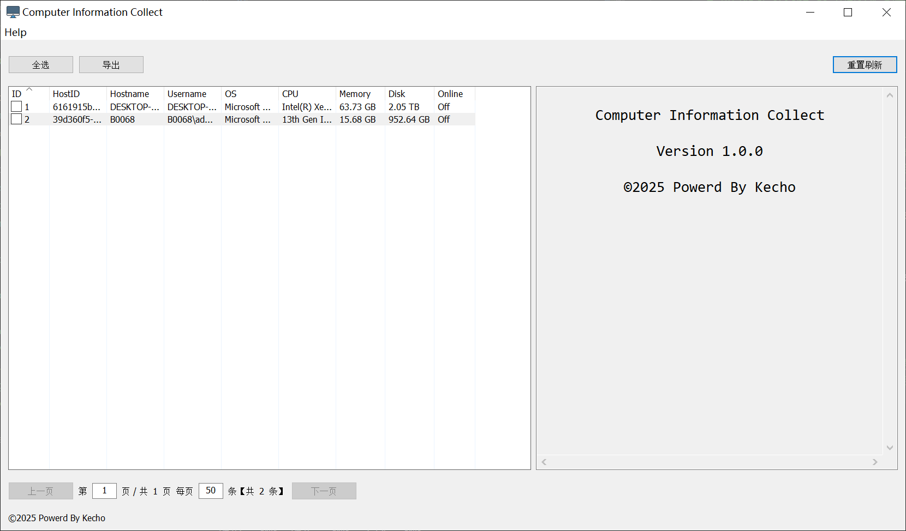
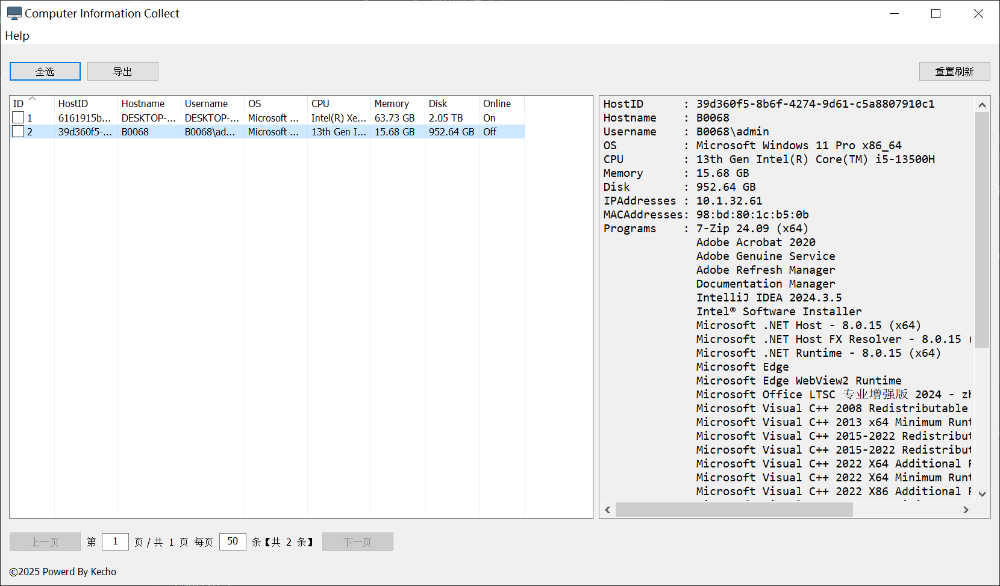
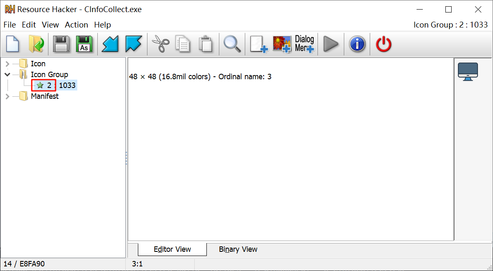

## 介绍
这是一款能够收集电脑主机名、用户名、CPU、内存、磁盘、IP、MAC 地址等信息的工具。

功能：
- 支持系统托盘
- 客户端支持静默启动
- 客户端信息定时上报
- 服务端提供 GUI 
- 支持信息分页查询
- 支持客户端在线检测
- 日志持久化保存


> 灵感来源：公司内网有多台电脑，为了方便对其进行盘点，开发了这款小工具。虽然工具的功能比较简单，但是基本上能满足需求，同时也可用于学习 Go 和 Walk 框架

> 使用集成：通过域控 Active Directory 下发脚本将程序批量复制到客户机并设置开机自启，后期可通过获取到的客户端 IP 进行远程桌面连接协助

## 编译
```bash
git clone https://github.com/kechocy/CInfoCollect.git
go mod tidy
go build -ldflags "-H windowsgui" -o CInfoCollect.exe
# 可以修改 main.go 中默认服务端域名或 IP
```

## 启动

对于客户端

```bash
CInfoCollect.exe #（默认，启动带托盘的客户端）
CInfoCollect.exe -b #（静默启动客户端，不显示托盘）
CInfoCollect.exe -t 2 #（客户端定时上报间隔，单位：分钟）
CInfoCollect.exe -p 7890 #（指定连接默认服务端 collect.example.com 的端口号）
CInfoCollect.exe -p 7890 -ip "10.10.10.10" #（指定服务端 IP 和端口号）

# 组合使用
CInfoCollect.exe -b -t 2 -p 7890 -ip "10.10.10.10" 
```

对于服务端

```bash
CInfoCollect.exe -s #（启动服务端，默认监听 9870 端口）
CInfoCollect.exe -s -p 7890 #（启动服务端并指定端口号）
```

## 界面




## 附录

使用 `rsrc` 可将图标资源加载到 `syso` 文件中
```bash
go get github.com/akavel/rsrc
rsrc -manifest app.manifest -ico icon.ico
```
使用时通过 ID 获取资源
```go
icon, err := walk.NewIconFromResourceId(2)
```
具体 ID 可以利用 [resource_hacker](https://www.angusj.com/resourcehacker/#download) 工具查看对应 exe 文件获取，如图所示：



